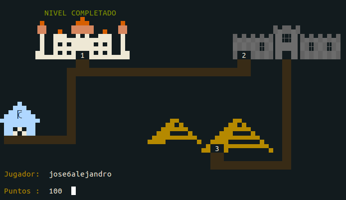
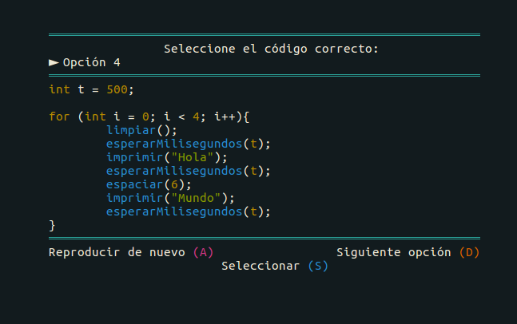

# 1.Juego para estimular la compresión de algoritmos básicos.

> Juego en terminal para reforzar la comprensión de algoritmos. (Publicación en curso) 
- **[Abrir](https://www.youtube.com/watch?v=hm5CWCPVrRc) Actividad realizada con el juego**

- **[Abrir](https://forms.gle/R9DrYZbevWkrB3Yv9) Cuestionario sobre el juego**
#### **Instalación y ejecución del juego**
**1)** Instalar mplayer con el comando sudo apt-get mplayer
```sh
$ sudo apt-get mplayer
```
**2)** Modificar la linea del archivo **Makefile** de acuerdo al Sistema Operativo:

-   Linux 32bits:
```sh
 biblioteca = 32bits
```
-   Linux 64bits:
    
```sh
 biblioteca = 64bits
```
**3)** Compilar el programa
```sh
$ make juego
```
**4)** Ejecutar el programa
```sh
$ ./juego
```

## Captura del juego



